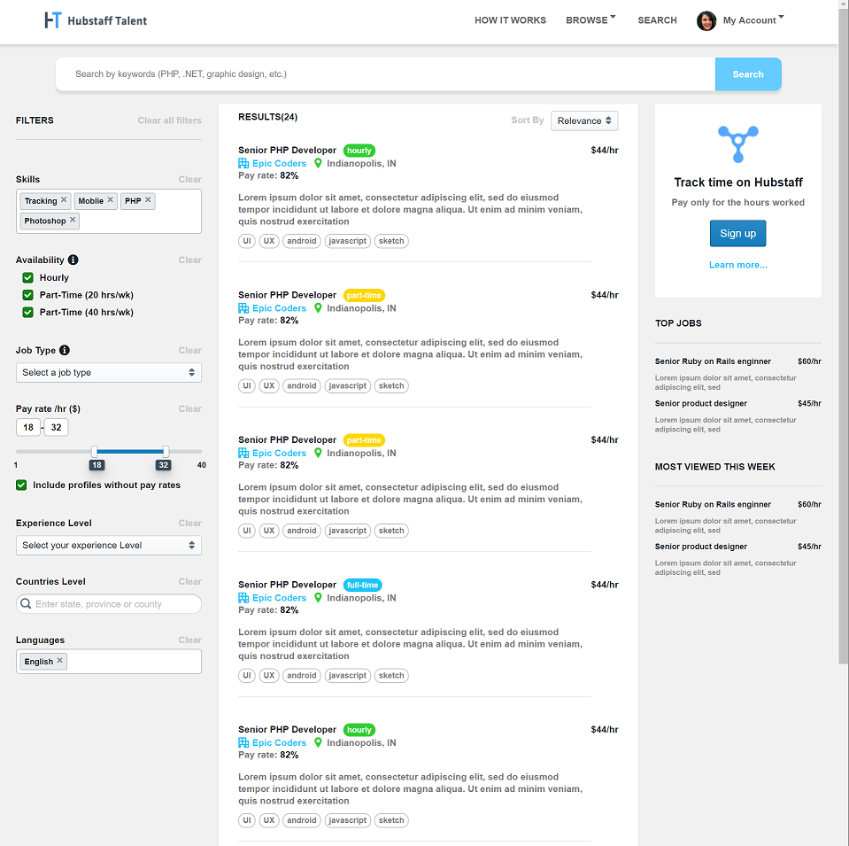

# Coding Challange 

Things I'd add if I had more time:
- Jest for unit tests 🎉
- Style Component Library 💅
- Mobile Components (Ie, return custom components on smaller screen sizes)
- General CSS clean up 💪
- A cool webserver to GET from

The guidelines asked for a server with query support (for filtering), full CRUD endpoints and that the design is followed exactly. Unfortunately, working full time I lack the time to do all that you've asked. Instead I've hacked out an awesome basic template of your UI. I'd take a look at my other repos for more examples of work I've done. 

This is a cool little 24/hr hacker challange I did that shows a React/Redux app
- https://github.com/ScottyEfird/Notes 

This is a cool little auth server with CRUD I build a while back
- https://github.com/ScottyEfird/simpleClient
- https://github.com/ScottyEfird/simpleServer

# How to run this web app

Note: Must have Node installed. 
```
> yarn install
> yarn start
```




## Packages used
[React](https://reactjs.org/)

[Styled Components](https://www.styled-components.com/)

[Blueprint](http://blueprintjs.com/)

For full list, see ```package.json```
